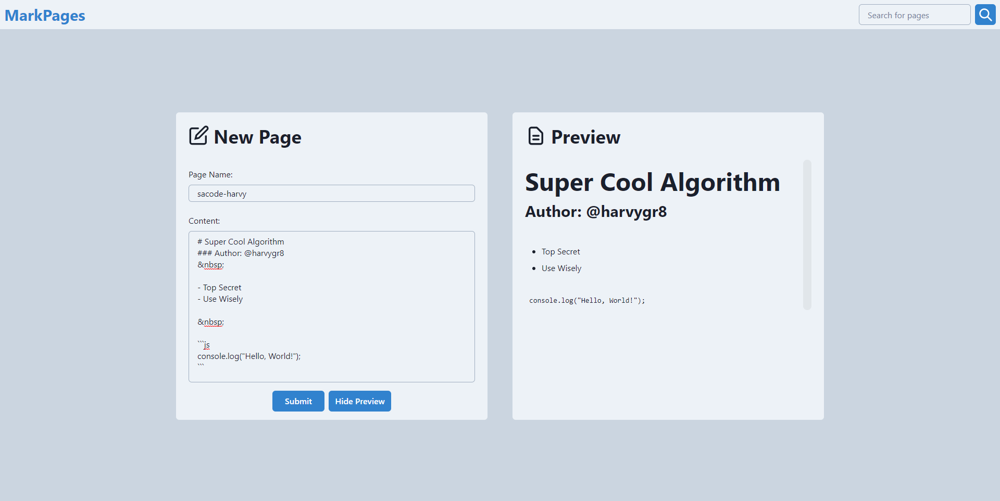

# mark-pages
 Web app made with Next.JS , MongoDB and Chakra UI that allows you to paste and share text quickly

 

# About
  mark-pages is a Text Sharing WebApp that allows you to input markdown text data and get a shareable link to access your markdown text from anywhere.

# Installation
  - Run The Following Command to install dependencies
  ```sh
  npm install
  ```
  - Enter your mongodb URI in the next.config.js file
  
  - To Run the application
  ```sh
  npm run dev

  ```
